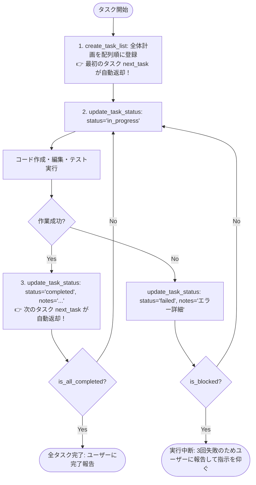

# 🛡️ tasks-mcp (Guardrail Task Management MCP Server)

[](https://www.rust-lang.org/)
[](https://modelcontextprotocol.io/)
[](LICENSE)

> **「モデルの賢さ」に過度に依存せず、外部環境（ハーネス）側で状態と制約を担保する。**  
> 軽量モデルでも迷子にならず、スキップや勝手な完了を物理的に遮断して決定論的にタスクを完遂させる Rust 製 Model Context Protocol (MCP) サーバー。

---

## 🤖 AIエージェント向け利用ガイド (For AI Agents)

あなたがコーディングや調査タスクを自律実行する際は、必ず以下の **「1タスクずつ順次完遂する黄金ループ」** に従ってください。

### 🔄 基本的な実行ループ (The Execution Loop)



> **💡 ゼロ・エクストラターン設計**:
> `create_task_list` やタスク完了時の `update_task_status` のレスポンスに、次に着手すべき `next_task` が自動で含まれるため、**`get_next_task` を呼ぶための推論＆ツール呼び出し往復（ターン）が丸ごと不要** になりました！
> （※ `get_next_task` は作業再開時や現在状態の確認用としていつでも呼び出し可能です）

### ⚡ ガードレール制約 (Guardrail Constraints)
サーバー側で以下の物理制約が強制されます。違反した場合は `isError: true` と自己修正ガイダンスメッセージが返却されます。

1. **一直線シーケンシャル実行 (Strict Linear Pipeline)**:
   - 先行タスク（Index N）が `completed` になるまで、後続タスク（Index N+1）には絶対に着手（`in_progress`）も完了（`completed`）もできません。
   - スキップや飛び越えは物理的に遮断されます。
2. **単一アクティブ制約 (Single Active Constraint)**:
   - 同時に `in_progress` にできるタスクは**常に1つだけ**です。別のタスクを開始する前に、必ず現在のタスクを完了または失敗させてください。
3. **サーキットブレーカー (Circuit Breaker)**:
   - 同一タスクで 3 回連続して `failed` 状態になると、自動的に `is_blocked: true`（中断）になります。
   - 無限ループに陥るのを防ぐため、ブロックされた場合は作業を中断し、ユーザー（人間）に状況を報告して判断を仰いでください。

---

## 🌟 主な特徴 (Features)

- **迷わせない極小ツールセット**: `create_task_list`, `get_next_task`, `update_task_status`, `get_task_summary` の4つのみ。
- **透明性のあるローカル永続化**: 状態はすべて `.agents/tasks.json` にアトミック保存。DBを排し、人間がエディタで直接確認・手動修正が可能。
- **追記専用 JSONL 監査ログ**: `.agents/tasks.log.jsonl` にすべてのツール呼び出し、実行時間、ガードレール判定、ステータス変更履歴をリアルタイム記録。
- **stdio 通信完全保護**: トレースログはすべて `stderr` に出力され、MCP JSON-RPC プロトコルが流れる `stdout` を一切汚しません。
- **ゼロ外部依存・爆速ネイティブバイナリ**: Rust で実装され、Node.js や Python ランタイム不要の単一バイナリ（約2.2MB）。

---

## 📦 インストール & ビルド (Installation & Build)

### 前提条件
- Rust 1.75+ (Cargo)

### ビルド手順

```bash
git clone https://github.com/your-org/tasks-mcp.git
cd tasks-mcp

# リリースバイナリのビルド
cargo build --release
```

成果物バイナリは `target/release/tasks-mcp.exe`（Linux/macOS の場合は `target/release/tasks-mcp`）に生成されます。

---

## ⚙️ MCP クライアント設定例 (Configuration)

### 1. Claude Desktop (`claude_desktop_config.json`)

```json
{
  "mcpServers": {
    "tasks": {
      "command": "C:\\Users\\<YourUsername>\\dev\\tasks-mcp\\target\\release\\tasks-mcp.exe",
      "args": [
        "--storage-dir", ".agents",
        "--log-level", "info"
      ]
    }
  }
}
```

### 2. Cursor / Cline / Roo Code / Antigravity

各ツールの MCP 設定ファイル（`mcpSettings.json` 等）に以下を追加してください。

```json
{
  "mcpServers": {
    "tasks": {
      "command": "/path/to/tasks-mcp",
      "args": ["--storage-dir", ".agents"]
    }
  }
}
```

---

## 🛠️ CLI オプション (CLI Usage)

```text
Usage: tasks-mcp.exe [OPTIONS]

Options:
      --storage-dir <STORAGE_DIR>  Directory to persist task state files and audit logs [default: .agents]
      --log-level <LOG_LEVEL>      Log level (trace, debug, info, warn, error) [default: info]
  -h, --help                       Print help
  -V, --version                    Print version
```

---

## 📋 MCP ツールリファレンス (Tool Reference)

### 1. `create_task_list`
順序付きタスクリストを新規登録・初期化します。配列のインデックス順が暗黙の実行パイプライン順序になります。

**引数**:
```json
{
  "tasks": [
    {
      "id": "task-1",
      "title": "要件確認と設計",
      "description": "仕様書を確認して設計方針を固める"
    },
    {
      "id": "task-2",
      "title": "実装",
      "description": "コアロジックを実装する"
    }
  ]
}
```

**戻り値の例**:
```json
{
  "success": true,
  "task_count": 2,
  "next_task": {
    "id": "task-1",
    "title": "要件確認と設計",
    "description": "仕様書を確認して設計方針を固める",
    "status": "pending",
    "retry_count": 0
  },
  "message": "タスクリストが正常に初期化されました。最初のタスク 'task-1' に着手してください。"
}
```

### 2. `get_next_task`
次に着手すべき単一のタスクを取得します。進行中（`in_progress`）のタスクがあればそれを最優先で返し、なければ未完了の先頭タスク（`pending`）を返します。

**引数**: なし (`{}`)

**戻り値の例**:
```json
{
  "task": {
    "id": "task-1",
    "title": "要件確認と設計",
    "description": "仕様書を確認して設計方針を固める",
    "status": "pending",
    "retry_count": 0,
    "history": []
  },
  "total_tasks": 2,
  "completed_tasks": 0,
  "is_all_completed": false,
  "is_blocked": false
}
```

### 3. `update_task_status`
タスクのステータス更新および作業メモの記録を行います。タスクを `completed` に更新した際は、次に着手すべき `next_task` が自動返却されます。ガードレール制約に違反した場合は物理的に遮断されエラーが返ります。

**引数**:
- `id` (string, 必須): 更新対象のタスクID
- `status` (string, 必須): `"pending" | "in_progress" | "completed" | "failed"`
- `notes` (string, 任意): 作業メモ・エラー履歴

**戻り値の例 (タスク完了時)**:
```json
{
  "success": true,
  "task_id": "task-1",
  "status": "completed",
  "retry_count": 0,
  "next_task": {
    "id": "task-2",
    "title": "実装",
    "description": "コアロジックを実装する",
    "status": "pending",
    "retry_count": 0
  },
  "is_all_completed": false,
  "message": "タスク 'task-1' を完了しました。次のタスク 'task-2' に着手してください。"
}
```

### 4. `get_task_summary`
全体の進捗サマリーを取得します。

**引数**: なし (`{}`)

**戻り値の例**:
```json
{
  "total_tasks": 2,
  "completed_tasks": 1,
  "progress_percent": 50.0,
  "current_active_task_id": "task-2",
  "status_summary": [
    { "id": "task-1", "title": "要件確認と設計", "status": "completed" },
    { "id": "task-2", "title": "実装", "status": "in_progress" }
  ],
  "formatted_summary": "進捗状況: 1/2 (50.0%)\n進行中: task-2\n残り: 0 件"
}
```

---

## 🛑 サーキットブレーカーと人間介入復旧 (Human-in-the-loop Recovery)

同一タスクで 3 回連続して `failed` 状態になると、サーキットブレーカーが作動して `is_blocked: true` となり、エージェントの自律実行が中断されます。

### 復旧手順 (Recovery Steps)
1. 人間（開発者）がプロジェクト直下の `.agents/tasks.json` を任意のエディタで開きます。
2. 該当タスクの状況を確認し、必要に応じて手動でコードを修正するか、タスクの `status` を `"completed"` または `"pending"`（`retry_count: 0`）に直接書き換えて保存します。
3. エージェントに「手動修正したので再開してください」と指示すると、エージェントが `get_next_task` を呼び出してパイプラインが自動再開されます。

---

## 🔍 監査ログの確認 (`tasks.log.jsonl`)

すべてのツール呼び出しおよびガードレール違反は `.agents/tasks.log.jsonl` にリアルタイムで記録されます。

```jsonl
{"timestamp":"2026-09-27T02:50:53Z","event_type":"tool_call","tool_name":"create_task_list","input":{"tasks":[...]},"output":{"success":true},"duration_ms":2}
{"timestamp":"2026-09-27T02:51:00Z","event_type":"guardrail_violation","tool_name":"update_task_status","input":{"id":"task-2","status":"in_progress"},"duration_ms":1,"violation_detail":"Predecessor task 'task-1' (index 0) is not completed; cannot start 'task-2'"}
```

後から「エージェントがどこで躓いたのか」「どのような順序でタスクを消化したのか」を完全に可視化・分析できます。

---

## 🧪 テストの実行 (Testing)

```bash
# 単体テスト & 統合シナリオテストの実行
cargo test --all-targets

# 静的解析チェック
cargo clippy --all-targets -- -D warnings
```

---

## 📜 仕様書 (Specifications)

本プロジェクトは **スペック駆動開発 (SDD)** に基づき設計・開発されています。
詳細な仕様や設計意図については `doc/` ディレクトリを参照してください。

- [`doc/product.md`](doc/product.md): 製品概要・ゴール
- [`doc/tech.md`](doc/tech.md): 技術スタック・アーキテクチャ方針
- [`doc/structure.md`](doc/structure.md): ディレクトリ構成
- [`doc/requirements.md`](doc/requirements.md): EARS記法による要求仕様（全12要件）
- [`doc/design.md`](doc/design.md): 詳細アーキテクチャ・状態遷移・IPO設計

---

## 📄 ライセンス (License)

本プロジェクトは **[Apache License, Version 2.0](LICENSE)** の下で公開されています。
商用・非商用を問わず、許諾条件に従って自由にご利用・改変・再配布いただけます。
詳細は [`LICENSE`](LICENSE) ファイルをご確認ください。
