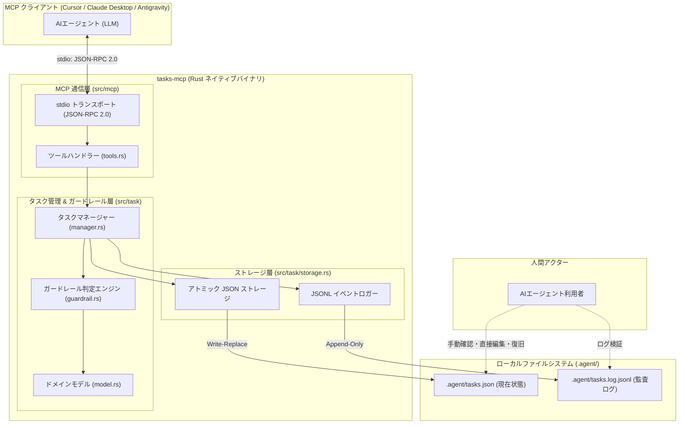
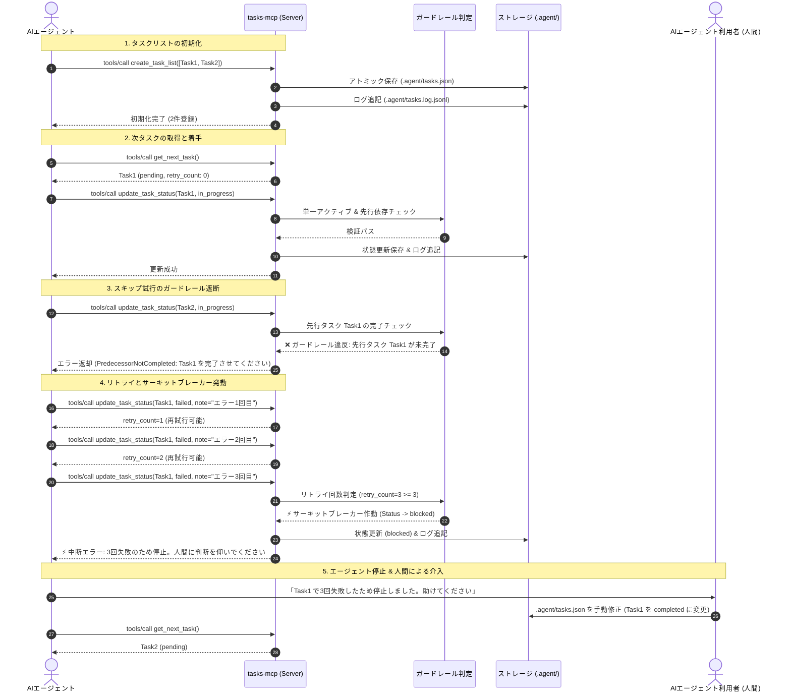
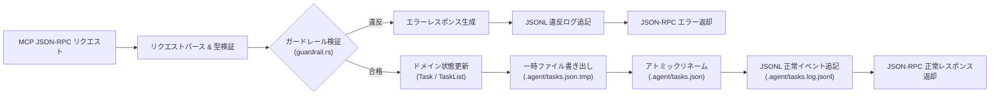
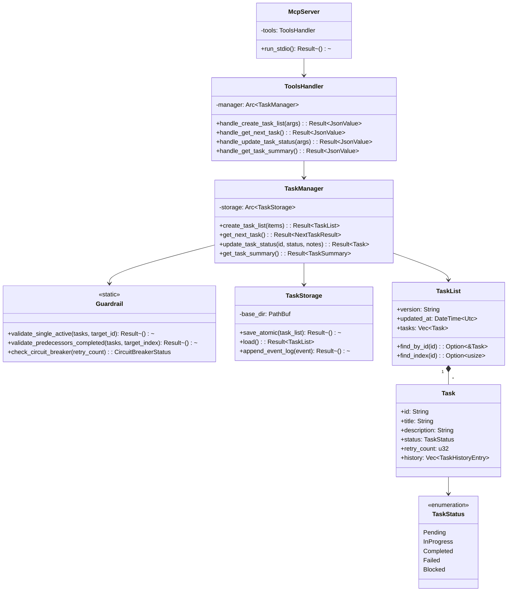
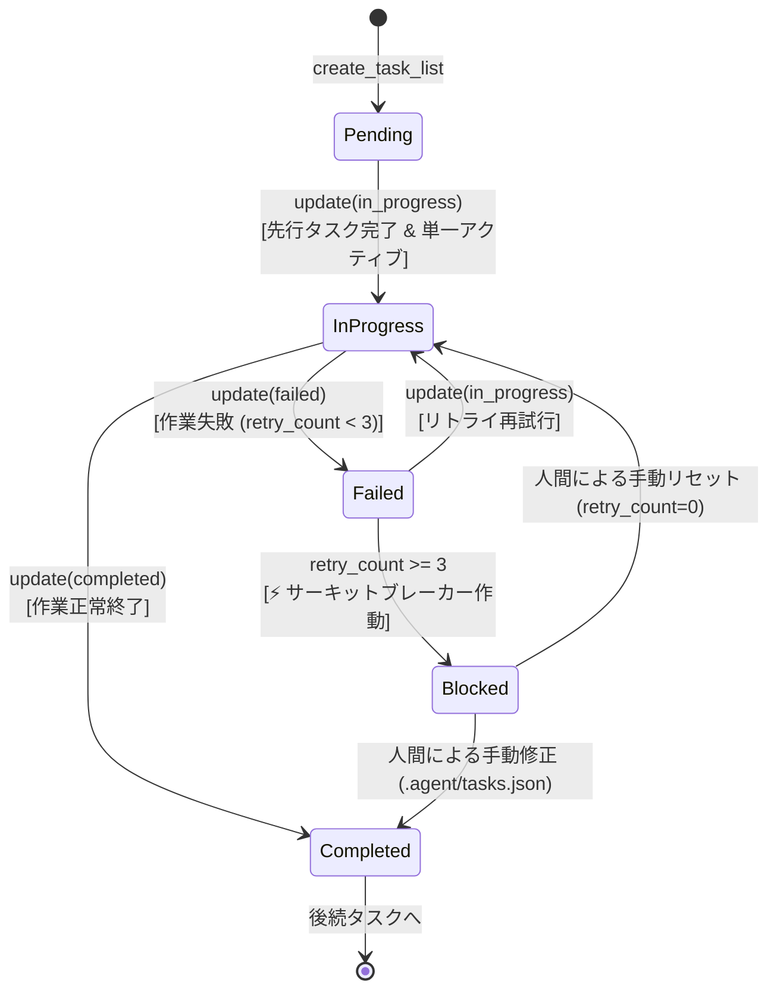

# 基本設計書 (design.md)

## 目次

- [機能一覧](#機能一覧)
- [機能詳細](#機能詳細)
  - [機能カテゴリA: タスク初期化 & 順序管理](#機能カテゴリa-タスク初期化--順序管理)
  - [機能カテゴリB: ガードレール制約 & 一直線実行制御](#機能カテゴリb-ガードレール制約--一直線実行制御)
  - [機能カテゴリC: 進捗可視化 & ローカル透過永続化・ログ](#機能カテゴリc-進捗可視化--ローカル透過永続化ログ)
  - [機能カテゴリD: MCP 通信 & 実行基盤](#機能カテゴリd-mcp-通信--実行基盤)
- [アーキテクチャ](#アーキテクチャ)
  - [設計方針](#設計方針)
  - [全体構成図](#全体構成図)
  - [レイヤー構造](#レイヤー構造)
  - [全体シーケンス図](#全体シーケンス図)
  - [データフロー図](#データフロー図)
- [インターフェース仕様](#インターフェース仕様)
  - [MCP ツールインターフェース](#mcp-ツールインターフェース)
  - [データ永続化仕様](#データ永続化仕様)
- [コンポーネント & クラス設計](#コンポーネント--クラス設計)
  - [クラス図概要 (High-Level Overview)](#クラス図概要-high-level-overview)
  - [詳細モジュール & 構造体設計](#詳細モジュール--構造体設計)
  - [IPO 一覧表](#ipo-一覧表)
- [データモデル & 状態遷移](#データモデル--状態遷移)
- [エラーハンドリング & ガードレール通知](#エラーハンドリング--ガードレール通知)
- [テスト・検証戦略 (MCP Inspector 実機検証)](#テスト検証戦略-mcp-inspector-実機検証)

---

## 機能一覧

| 機能カテゴリ | 機能ID | 機能名 | 概要 | 対応要件ID |
|:---|:---|:---|:---|:---|
| **初期化 & 順序管理** | F-A1 | タスクリスト初期登録 | 配列順序を厳格な実行順序としてタスクリストを初期作成する | 要件 A-1 |
| **初期化 & 順序管理** | F-A2 | リニア順序の不変性保証 | 作成後のタスク順序変更や割り込み追加を遮断する | 要件 A-2 |
| **ガードレール & 制御** | F-B1 | 次タスク取得 | 現在未完了の先頭タスクを特定しエージェントに提示する | 要件 B-1 |
| **ガードレール & 制御** | F-B2 | シングルアクティブ制約強制 | 同時に進行中にできるタスクを厳格に1つに制限する | 要件 B-2 |
| **ガードレール & 制御** | F-B3 | 暗黙的先行依存 & スキップ遮断 | 直前タスク未完了時の後続着手を物理的に遮断する | 要件 B-3 |
| **ガードレール & 制御** | F-B4 | ステータス遷移 & メモ記録 | 許可された遷移のみを受理し、実行メモを追記する | 要件 B-4 |
| **ガードレール & 制御** | F-B5 | サーキットブレーカー (実行中断) | 同一タスク3回失敗時に自動中断し人間に判断を委託する | 要件 B-5 |
| **可視化 & 永続化** | F-C1 | 全体進捗サマリー出力 | 完了率、現在タスク、残りタスクを整形して出力する | 要件 C-1 |
| **可視化 & 永続化** | F-C2 | ローカルJSONアトミック保存 | `.agent/tasks.json` に安全にアトミック書き込みする | 要件 C-2 |
| **可視化 & 永続化** | F-C3 | 監査用JSONLイベントログ出力 | ツール引数・結果・制約違反を `.agent/tasks.log.jsonl` に追記する | 要件 C-3 |
| **MCP基盤** | F-D1 | stdio JSON-RPC 2.0 通信 | MCP標準stdioトランスポートでクライアントと対話する | 要件 D-1 |
| **MCP基盤** | F-D2 | stdout保護 & stderrロギング | stdoutをJSON-RPCに専有させ、ログはstderrに限定出力する | 要件 D-2 |

---

## 機能詳細

### 機能カテゴリA: タスク初期化 & 順序管理

- **F-A1: タスクリスト初期登録 (`create_task_list`)**
  - **概要**: クライアントから提供されたタスク配列を受け取り、配列のインデックス順を暗黙の実行パイプライン順序として初期登録する。
  - **対応要件**: 要件 A-1
  - **設計のポイント**:
    - タスクIDの重複を検証し、1件でも重複があれば `TaskListError::DuplicateTaskId` を返却して登録を拒否する。
    - 各タスクの初期ステータスは一律 `pending`、リトライ回数は `0`、初期メモ配列は空とする。

- **F-A2: リニア順序の不変性保証**
  - **概要**: タスクリスト登録後のタスク順序変更・タスク途中挿入・タスク削除の API を意図的に提供せず、登録時の配列順序を不変に保つ。
  - **対応要件**: 要件 A-2
  - **設計のポイント**:
    - タスクの途中追加や削除はエージェントを迷わせる主因となるため、API レベルで機能を排除する。計画を変更する場合は `create_task_list` の再呼び出し（全量再登録）のみを許容する。

### 2.2 機能カテゴリB: ガードレール制約 & 一直線実行制御

- **F-B1: 次タスク取得 (`get_next_task`)**
  - **概要**: エージェントが次に取り組むべき単一のタスクを取得する。
  - **対応要件**: 要件 B-1
  - **設計のポイント**:
    - リストを先頭から走査し、`in_progress` またはリトライ可能な `failed`（`retry_count < 3`）のタスクがあればそれを優先返却。
    - それらがなければ、未着手（`pending`）の最前タスクを返却。
    - すべてのタスクが `completed` の場合は、`is_all_completed: true` を含むサマリーを返却。
    - サーキットブレーカー作動中（`blocked`）の場合は、中断状態である旨とブロック理由を明確に返却する。

- **F-B2: シングルアクティブ制約強制**
  - **概要**: システム全体で `in_progress` 状態になれるタスクを常に最大1つに限定する。
  - **対応要件**: 要件 B-2
  - **設計のポイント**:
    - `update_task_status` でステータスを `in_progress` に更新する際、自分以外のタスクに `in_progress` が存在しないかを O(N) 走査でチェック。
    - 既存の `in_progress` タスクがある場合は `GuardrailViolation::MultipleActiveTasks` を即座に返し、現在のタスクを完了または中断させるよう促す。

- **F-B3: 暗黙的先行依存 & スキップ遮断**
  - **概要**: インデックス $N$ のタスクは、インデックス $0 \le i < N$ の全先行タスクが `completed` でない限り着手できない。
  - **対応要件**: 要件 B-3
  - **設計のポイント**:
    - タスク $N$ を `in_progress` または `completed` に変更しようとした際、インデックス $N-1$ 以前に1つでも未完了（`pending`, `failed`, `blocked`）タスクがあれば `GuardrailViolation::PredecessorNotCompleted` を返却。
    - スキップ（タスクの飛ばし）を物理的に不可能にし、モデルのサボりや飛び越しを完全に封殺する。

- **F-B4: ステータス遷移 & メモ記録**
  - **概要**: タスクステータス（`pending`, `in_progress`, `completed`, `failed`）の遷移を妥当性検証し、エージェントの作業メモを履歴に追加する。
  - **対応要件**: 要件 B-4
  - **設計のポイント**:
    - 遷移時にタイムスタンプ付きでメモ（notes）を `TaskHistoryEntry` として追加記録する。

- **F-B5: サーキットブレーカー (実行中断)**
  - **概要**: 同一タスクで3回失敗（`failed`）した場合、リストの実行を強制中断（`blocked`）し、エージェントの自動リトライを停止して人間の介入を待つ。
  - **対応要件**: 要件 B-5
  - **設計のポイント**:
    - ステータスが `failed` になるたびに `retry_count` を `+1`。
    - `retry_count >= 3` に達した場合、タスク状態を自動的に `blocked` へ遷移させ、パイプライン全体を停止する。
    - 人間が `.agent/tasks.json` を直接編集して `retry_count` をリセットするか `completed` に変更することで復旧可能。

### 2.3 機能カテゴリC: 進捗可視化 & ローカル透過永続化・ログ

- **F-C1: 全体進捗サマリー出力 (`get_task_summary`)**
  - **概要**: タスク全体の消化率（例: 3/10 完了、30%）、現在のアクティブタスク、残タスク一覧を整形して返却。
  - **対応要件**: 要件 C-1
  - **設計のポイント**:
    - エージェントが現在の進捗状況を一目で把握できるプレーンテキスト表現と構造化オブジェクトを併せて提供。

- **F-C2: ローカルJSONアトミック保存**
  - **概要**: タスク状態変更時に `.agent/tasks.json` へ安全に書き出す。
  - **対応要件**: 要件 C-2
  - **設計のポイント**:
    - 同一ディレクトリ内に一時ファイル（`.agent/tasks.json.tmp.XXXX`）を作成して書き出し・fsync 後にリネーム（置換）するアトミック書き込み（Write-Replace）を採用。電源断やプロセスキル時でもファイル破損を防止。

- **F-C3: 監査用JSONLイベントログ出力**
  - **概要**: ツール呼び出し、引数、戻り値、所要時間、ガードレール判定イベントを `.agent/tasks.log.jsonl` にリアルタイム追記。
  - **対応要件**: 要件 C-3
  - **設計のポイント**:
    - 追記専用（Append-only）モードでファイルを開き、JSON行をフラッシュ出力。デバッグやエージェントの行動分析を容易にする。

### 2.4 機能カテゴリD: MCP 通信 & 実行基盤

- **F-D1: stdio JSON-RPC 2.0 通信**
  - **概要**: 標準入出力を用いた MCP プロトコル準拠のメッセージ送受信。
  - **対応要件**: 要件 D-1
  - **設計のポイント**:
    - 非同期行ベース読み込み (`tokio::io::AsyncBufReadExt`) でリクエストを処理し、JSON-RPC 2.0 仕様に厳格に沿ったレスポンスを生成。

- **F-D2: stdout保護 & stderrロギング**
  - **概要**: 標準出力への非プロトコル文字列混入を100%防止する。
  - **対応要件**: 要件 D-2
  - **設計のポイント**:
    - `tracing_subscriber::fmt().with_writer(std::io::stderr)` を強制。stdout への `println!` や `eprintln!` の直書きをコードレビューおよび clippy で禁止。

---

## アーキテクチャ

### 設計方針

1. **ガードレールファースト (Harness-as-Guardrail)**:
   - モデルの自律的判断に頼らず、サーバー側の検証関数が絶対的な制約として振る舞う。制約違反時は Fail-Fast で明確なガイダンスエラーを返す。
2. **ローカル透過性 ＆ 監査性 (Local Transparency & Auditability)**:
   - 内部状態はすべて `.agent/tasks.json`（現在状態）と `.agent/tasks.log.jsonl`（履歴ログ）という可読性の高いプレーンテキストに永続化し、Git 差分追跡と人間による直接修正を可能にする。
3. **ゼロ外部依存 ＆ 単一バイナリ (Zero External Dependencies)**:
   - Node.js や Python 等のランタイムを一切不要とし、Rust 製の軽量・高速なネイティブ単一バイナリとして配布・実行する。
4. **プロトコル境界の疎結合 (6ヶ月テスト検証済み)**:
   - MCP プロトコルハンドラー層 (`src/mcp`) とタスク管理・ガードレール層 (`src/task`) を明確に分離。将来 CLI ツールや HTTP サーバーとして再利用する場合でも、`src/task` のコアロジックを1行も変更せずに再利用可能とする。
5. **モジュール境界の意図永続化 (L1 Intent)**:
   - `src/mcp/README.md` および `src/task/README.md` を配置し、各パッケージの責務・依存制約・設計理由を永続化する。

### 3.2 全体構成図

- 下記の図は、`tasks-mcp` システムのコンポーネント配置と依存関係を示した静的構成図である。
- クライアントからの stdio 入力は MCP 層でディスパッチされ、タスク管理ドメイン層がガードレール判定を行った上で、ストレージ層へアトミック永続化およびログ出力を行う。



### 3.3 レイヤー構造

各レイヤーの責務と許可される依存関係は以下の通りである。

| レイヤー | ディレクトリ | 主な責務 | 依存してよいモジュール |
|:---|:---|:---|:---|
| **Entrypoint** | `src/main.rs` | CLI 引数パース、stderr ログ初期化、MCP サーバー起動 | `src/mcp`, `src/task`, `src/error` |
| **MCP Layer** | `src/mcp/` | JSON-RPC 2.0 プロトコル処理、MCP ツール定義、リクエスト/レスポンス変換 | `src/task`, `src/error` |
| **Domain Layer** | `src/task/` | タスクモデル、リニア実行制御、シングルアクティブ・サーキットブレーカー判定 | `src/error` のみ（プロトコル層への逆依存は厳禁） |
| **Storage Layer** | `src/task/storage.rs` | アトミックファイル保存、JSONL ログ追記 | `src/task/model`, `src/error` |
| **Error Domain** | `src/error.rs` | ガードレール違反エラー、ファイルI/Oエラーの型定義 | 外部 crate (`thiserror`) のみ |

### 3.4 全体シーケンス図

- 下記のシーケンス図は、AIエージェントがタスクを取得・更新し、3回失敗時にサーキットブレーカーが発動して人間が復旧する一連のインタラクションを示す。



### 3.5 データフロー図

- 下記の図は、クライアントからのツール呼び出しリクエストがどのようにバリデーションされ、永続化・ログ出力されるかのデータ変換フローを示す。



---

## 4. インターフェース仕様

### 4.1 MCP ツールインターフェース

#### ツール一覧

| ツール名 | 概要 | 主な利用アクター |
|:---|:---|:---|
| `create_task_list` | 順序付きタスクリストの新規初期登録 | AIエージェント |
| `get_next_task` | 次に着手すべき単一タスクの取得 | AIエージェント |
| `update_task_status` | タスクステータスの更新・メモ記録 | AIエージェント |
| `get_task_summary` | 全体進捗状況サマリーの取得 | AIエージェント |

---

#### ツール詳細 IPO 仕様

##### 1. `create_task_list`
- **入力 (Input)**:
  ```json
  {
    "tasks": [
      {
        "id": "task-1",
        "title": "要件の確認とディレクトリ準備",
        "description": "README を確認して必要な初期構成を整える"
      },
      {
        "id": "task-2",
        "title": "コアロジックの実装",
        "description": "モデルおよびガードレールの実装を行う"
      }
    ]
  }
  ```
- **処理概要 (Processing)**:
  1. タスク配列が空でないか、ID に重複がないかを検証。
  2. 各タスクのステータスを `pending`、`retry_count` を `0` として `TaskList` を生成。
  3. `.agent/tasks.json` にアトミック保存し、`.agent/tasks.log.jsonl` に登録イベントを記録。
- **出力 (Output)**:
  ```json
  {
    "success": true,
    "task_count": 2,
    "message": "タスクリストが正常に初期化されました。get_next_task を呼び出して作業を開始してください。"
  }
  ```

##### 2. `get_next_task`
- **入力 (Input)**: なし（空のパラメータ `{}`）
- **処理概要 (Processing)**:
  1. タスクリストを走査し、`in_progress` またはリトライ可能な `failed`（`retry_count < 3`）のタスクがあればそれを取得。
  2. なければ、リスト先頭から順に未着手（`pending`）の最前タスクを取得。
  3. `blocked` のタスクが存在する場合は、サーキットブレーカー発動中として警告情報を付与。
  4. 全タスクが `completed` の場合は、完了通知オブジェクトを生成。
- **出力 (Output)**:
  ```json
  {
    "task": {
      "id": "task-1",
      "index": 0,
      "title": "要件の確認とディレクトリ準備",
      "description": "README を確認して必要な初期構成を整える",
      "status": "pending",
      "retry_count": 0
    },
    "is_all_completed": false,
    "is_blocked": false,
    "total_tasks": 2,
    "completed_tasks": 0
  }
  ```

##### 3. `update_task_status`
- **入力 (Input)**:
  ```json
  {
    "id": "task-1",
    "status": "in_progress", // "in_progress" | "completed" | "failed"
    "notes": "作業に着手しました"
  }
  ```
- **処理概要 (Processing)**:
  1. 指定された ID のタスクの存在を確認。
  2. **ガードレール検証**:
     - `in_progress` への変更時: 他に `in_progress` がないか、直前の先行タスクがすべて `completed` かを検証。
     - `completed` への変更時: 直前の先行タスクがすべて `completed` かを検証。
     - `failed` への変更時: 当該タスクの `retry_count` を `+1`。`retry_count >= 3` の場合はステータスを自動的に `blocked` に更新。
  3. メモ履歴を追加し、`.agent/tasks.json` へ保存、`.agent/tasks.log.jsonl` へ記録。
- **出力 (Output)**:
  ```json
  {
    "success": true,
    "task_id": "task-1",
    "status": "in_progress",
    "retry_count": 0,
    "message": "タスクステータスを正常に更新しました。"
  }
  ```

##### 4. `get_task_summary`
- **入力 (Input)**: なし（空のパラメータ `{}`）
- **処理概要 (Processing)**:
  1. タスク全件を読み込み、総数・完了数・失敗数・進行中タスク・完了率（%）を集計。
  2. 人間およびモデルが読みやすいテキストサマリーを生成。
- **出力 (Output)**:
  ```json
  {
    "total_tasks": 2,
    "completed_tasks": 1,
    "progress_percent": 50.0,
    "current_active_task_id": "task-2",
    "status_summary": [
      { "id": "task-1", "title": "要件確認", "status": "completed" },
      { "id": "task-2", "title": "コア実装", "status": "in_progress" }
    ],
    "formatted_summary": "進捗状況: 1/2 (50.0%)\n進行中: [task-2] コア実装\n残り: 1 件"
  }
  ```

### 4.2 データ永続化仕様

#### 1. `.agent/tasks.json` (現在状態永続化スキーマ)
- **形式**: UTF-8 JSON、インデント整形 (Pretty-printed)
- **ファイルパス**: `{project_root}/.agent/tasks.json`
- **スキーマ定義**:
  ```json
  {
    "$schema": "http://json-schema.org/draft-07/schema#",
    "type": "object",
    "required": ["version", "updated_at", "tasks"],
    "properties": {
      "version": { "type": "string", "example": "1.0.0" },
      "updated_at": { "type": "string", "format": "date-time" },
      "tasks": {
        "type": "array",
        "items": {
          "type": "object",
          "required": ["id", "title", "description", "status", "retry_count", "history"],
          "properties": {
            "id": { "type": "string" },
            "title": { "type": "string" },
            "description": { "type": "string" },
            "status": { "type": "string", "enum": ["pending", "in_progress", "completed", "failed", "blocked"] },
            "retry_count": { "type": "integer", "minimum": 0 },
            "history": {
              "type": "array",
              "items": {
                "type": "object",
                "required": ["timestamp", "status", "notes"],
                "properties": {
                  "timestamp": { "type": "string", "format": "date-time" },
                  "status": { "type": "string" },
                  "notes": { "type": "string" }
                }
              }
            }
          }
        }
      }
    }
  }
  ```

#### 2. `.agent/tasks.log.jsonl` (監査ログ追記スキーマ)
- **形式**: UTF-8 JSON Lines (1行1JSON)、追記保存 (Append-only)
- **ファイルパス**: `{project_root}/.agent/tasks.log.jsonl`
- **1行あたりのレコード定義**:
  ```json
  {
    "timestamp": "2026-09-27T11:30:00.123Z",
    "event_type": "tool_call", // "tool_call" | "guardrail_violation" | "circuit_breaker_triggered"
    "tool_name": "update_task_status",
    "params": { "id": "task-2", "status": "in_progress" },
    "result": { "success": false, "error": "PredecessorNotCompleted" },
    "duration_ms": 1.25,
    "guardrail_violation": {
      "rule": "ImplicitPredecessorDependency",
      "detail": "Task 'task-1' at index 0 is not completed (current status: pending)"
    }
  }
  ```

---

## 5. コンポーネント & クラス設計

### 5.1 クラス図概要 (High-Level Overview)

- 下記の図は、主要なドメイン型、ストレージ、MCP サーバー間の関係を示すクラス/構造体図である。
- ドメインロジック（`TaskManager` と `Guardrail`）はストレージトレイトにのみ依存し、MCP プロトコル層から完全に独立している。



### 5.2 詳細モジュール & 構造体設計

#### 1. `src/task/model.rs` (ドメインモデル)
- **`TaskStatus` Enum**:
  ```rust
  #[derive(Debug, Clone, Copy, PartialEq, Eq, Serialize, Deserialize)]
  #[serde(rename_all = "snake_case")]
  pub enum TaskStatus {
      Pending,
      InProgress,
      Completed,
      Failed,
      Blocked, // サーキットブレーカー作動時の中断状態
  }
  ```
- **`Task` 構造体**:
  ```rust
  #[derive(Debug, Clone, Serialize, Deserialize)]
  pub struct Task {
      pub id: String,
      pub title: String,
      pub description: String,
      pub status: TaskStatus,
      pub retry_count: u32,
      pub history: Vec<TaskHistoryEntry>,
  }
  ```

#### 2. `src/task/guardrail.rs` (ガードレール検証エンジン)
- **関数の責務**:
  - `validate_single_active(tasks: &[Task], target_id: &str) -> Result<(), GuardrailError>`: 自身以外のタスクで `status == InProgress` が存在すればエラー。
  - `validate_predecessors(tasks: &[Task], target_index: usize) -> Result<(), GuardrailError>`: インデックス $0 \le i < \text{target\_index}$ に未完了タスクがあればエラー。
  - `check_circuit_breaker(retry_count: u32) -> bool`: リトライ回数が 3 以上か判定。

#### 3. `src/task/storage.rs` (ストレージ & アトミック操作)
- **`TaskStorage` 構造体**:
  - `save_atomic(&self, list: &TaskList) -> Result<()>`:
    1. `.agent` ディレクトリが存在しない場合は自動作成 (`create_dir_all`)。
    2. 同一階層にテンポラリファイルを作成し、JSON Pretty で書き出し。
    3. `std::fs::rename` によるアトミック置換。
  - `append_log(&self, entry: &LogEntry) -> Result<()>`:
    1. `.agent/tasks.log.jsonl` を `OpenOptions::new().create(true).append(true)` でオープン。
    2. JSON 文字列 + `\n` を安全に追記。

### 5.3 IPO 一覧表

| コンポーネント | メソッド名 | 入力 (Input) | 処理概要 (Processing) | 出力 (Output) |
|:---|:---|:---|:---|:---|
| `TaskManager` | `create_task_list` | `Vec<TaskCreateInput>` | ID重複検証、初期TaskList生成、アトミック保存、ログ追記 | `Result<TaskList>` |
| `TaskManager` | `get_next_task` | なし | 未完了最前タスク探索、サーキットブレーカー確認 | `Result<NextTaskResponse>` |
| `TaskManager` | `update_task_status` | `id: &str, status: TaskStatus, notes: Option<String>` | ガードレール検証、リトライ加算・ブロック判定、保存、ログ追記 | `Result<Task>` |
| `TaskManager` | `get_task_summary` | なし | 全件集計、進捗率計算、整形テキスト生成 | `Result<TaskSummary>` |
| `Guardrail` | `validate_single_active` | `tasks: &[Task], target_id: &str` | 既存の進行中タスク存在有無を検証 | `Result<()>` |
| `Guardrail` | `validate_predecessors` | `tasks: &[Task], target_index: usize` | 先行インデックスの完了状態を走査検証 | `Result<()>` |
| `TaskStorage` | `save_atomic` | `&TaskList` | 一時ファイル生成、fsync、アトミックリネーム | `Result<()>` |
| `TaskStorage` | `append_log` | `&LogEntry` | JSONL 行追記、フラッシュ | `Result<()>` |

---

## 6. データモデル & 状態遷移

### タスク状態遷移図

- 下記の状態遷移図は、タスクが生成されてから完了、またはリトライを経てサーキットブレーカー（中断）に至るライフサイクルを示す。



---

## 7. エラーハンドリング & ガードレール通知

エージェントが制約に違反した場合、単なる内部エラーではなく、**「何が違反しており、エージェントが次に何をすべきか」を教示するガイダンスメッセージ** を返却する。

| エラー種別 | ガードレール違反理由 | エージェントへの誘導メッセージ |
|:---|:---|:---|
| `MultipleActiveTasks` | 別のタスクがすでに `in_progress` である | 「タスク '{current_id}' が既に進行中です。新しいタスクを開始する前に、現在のタスクを完了（completed）させてください。」 |
| `PredecessorNotCompleted` | 先行タスクが完了していない（スキップ試行） | 「先行タスク '{prev_id}' が完了していません。リストの順番通りに前のタスクから完了させてください。」 |
| `CircuitBreakerHalted` | 同一タスクが3回失敗した | 「タスク '{task_id}' は3回失敗したため実行中断（blocked）されました。これ以上の自動リトライはできません。人間に支援を求めてください。」 |
| `DuplicateTaskId` | 初期化時にIDが重複している | 「タスクID '{task_id}' が重複しています。一意なIDでタスクリストを作成し直してください。」 |
| `TaskNotFound` | 指定されたIDが存在しない | 「タスクID '{task_id}' は存在しません。有効なタスクIDを指定してください。」 |

---

## 8. テスト・検証戦略 (MCP Inspector 実機検証)

本システムは、Rust の標準テストに加えて、MCP 公式検証ツールである **MCP Inspector** を用いた実機検証手順を標準採用する。

### 8.1 ユニットテスト & 結合テスト (`cargo test`)
- **ドメインロジックテスト (`src/task/guardrail.rs`)**:
  - 先行タスク未完了時のスキップ遮断テスト。
  - 同時2件以上の `in_progress` 遮断テスト。
  - 3回失敗時のサーキットブレーカー自動 `blocked` 遷移テスト。
- **ストレージテスト (`src/task/storage.rs`)**:
  - `tempfile` を用いたアトミック保存・復元テスト。
  - JSONL ログの追記整合性テスト。
- **結合テスト (`tests/guardrail_test.rs`)**:
  - 一連のシナリオ（作成 -> 取得 -> 進行 -> スキップ試行拒否 -> 失敗3回 -> 中断 -> 人間復旧 -> 完了）の E2E 検証。

### 8.2 MCP Inspector 実機検証手順

`references/mcp-inspector.md` に基づき、ビルド成果物バイナリに対して MCP Inspector CLI による疎通・挙動検証を実施する。

1. **バイナリのビルド**:
   ```bash
   cargo build
   ```

2. **ツールの登録一覧確認 (`tools/list`)**:
   ```bash
   npx @modelcontextprotocol/inspector --cli ./target/debug/tasks-mcp.exe --method tools/list
   ```
   - 期待結果: `create_task_list`, `get_next_task`, `update_task_status`, `get_task_summary` の4ツールが返却されること。

3. **タスク作成の検証 (`create_task_list`)**:
   ```bash
   npx @modelcontextprotocol/inspector --cli ./target/debug/tasks-mcp.exe \
     --method tools/call --tool-name create_task_list \
     --tool-arg tasks='[{"id":"t1","title":"タスク1","description":"テスト1"},{"id":"t2","title":"タスク2","description":"テスト2"}]'
   ```
   - 期待結果: 成功レスポンスが返り、`.agent/tasks.json` と `.agent/tasks.log.jsonl` が生成されること。

4. **ガードレール遮断の検証 (スキップ試行)**:
   ```bash
   npx @modelcontextprotocol/inspector --cli ./target/debug/tasks-mcp.exe \
     --method tools/call --tool-name update_task_status \
     --tool-arg id=t2 --tool-arg status=in_progress
   ```
   - 期待結果: ガードレール違反エラー（PredecessorNotCompleted）が返り、`.agent/tasks.log.jsonl` に違反イベントが記録されること。
